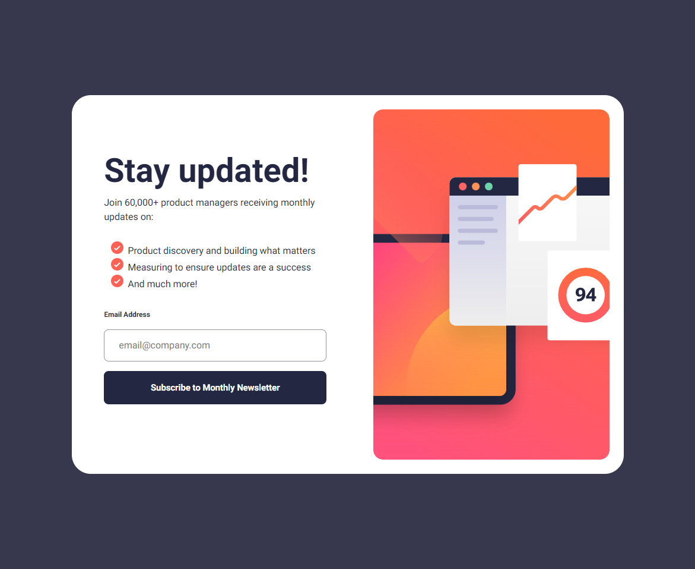

# Frontend Mentor - Newsletter sign-up form with success message solution

This is a solution to the [Newsletter sign-up form with success message challenge on Frontend Mentor](https://www.frontendmentor.io/challenges/newsletter-signup-form-with-success-message-3FC1AZbNrv). Frontend Mentor challenges help you improve your coding skills by building realistic projects. 

## Table of contents

- [Overview](#overview)
  - [The challenge](#the-challenge)
  - [Screenshot](#screenshot)
  - [Links](#links)
- [My process](#my-process)
  - [Built with](#built-with)
  - [What I learned](#what-i-learned)
  - [Continued development](#continued-development)
- [Author](#author)

## Overview

### The challenge

Users should be able to:

- Add their email and submit the form
- See a success message with their email after successfully submitting the form
- See form validation messages if:
  - The field is left empty
  - The email address is not formatted correctly
- View the optimal layout for the interface depending on their device's screen size
- See hover and focus states for all interactive elements on the page

### Screenshot

### Links

- Solution URL: [Github](https://github.com/CranJeus/newsletter-sign-up-with-success-message-main)
- Live Site URL: [Netlify](https://exquisite-marzipan-29ece7.netlify.app/)

## My process
a lot of my process was just hunting down bugs especially with the images and their behaviour. But like usual i break down the layout into its component pieces and see how they interact then group them accordingly. For this i decided to use hidden divs to handle the popup/popover.

### Built with

- Semantic HTML5 markup
- CSS custom properties
- Flexbox
- CSS Grid

### What I learned

A lot of what i learned here was to spend a bit more time planning then implementing. I had to swap about halfway through to go mobile first instead of desktop first, this ended up causing many bugs in and around refactoring.

### Continued development

now that i have a bit more of a base in the standard CSS and JS i wanna implement them in the frameworks i am familiar with (MERN and MEAN stacks). I also want to branch out into .net with C# and see how that goes.

## Author
- Frontend Mentor - [@CranJeus](https://www.frontendmentor.io/profile/CranJeus)